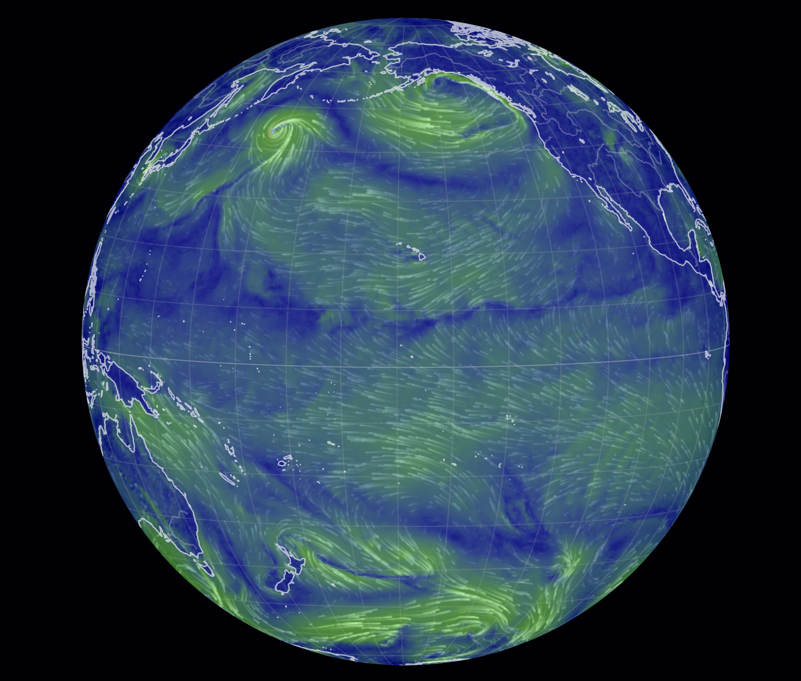
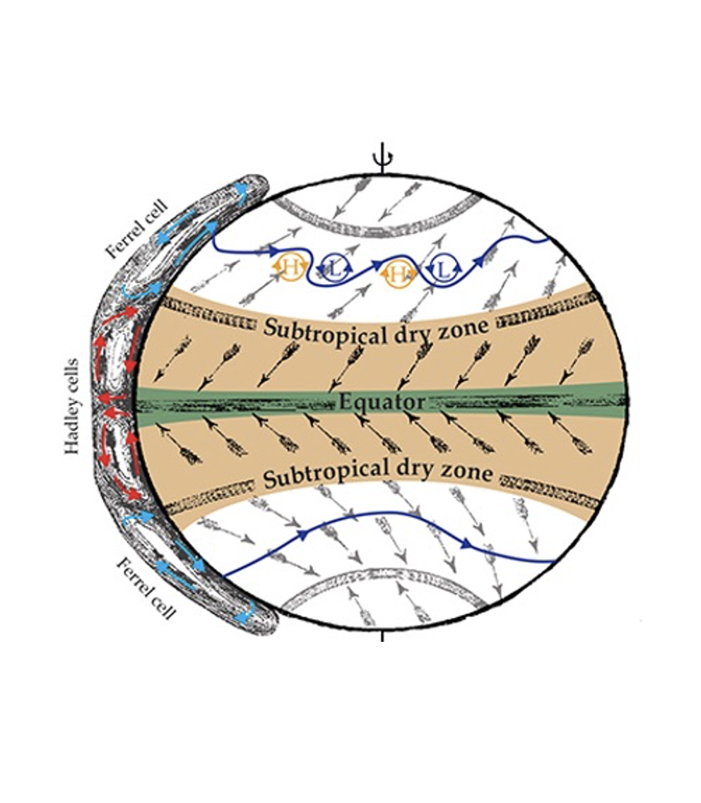
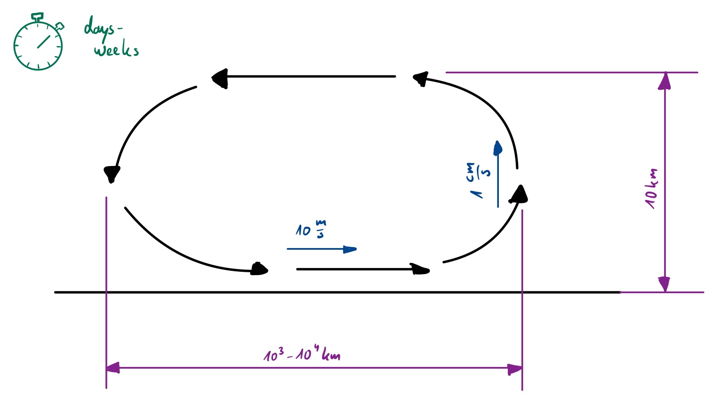

# Simulating the Atmosphere

## (for our project)

### (a very simplified overview)

---

## What can we expect (not) to see?

---

**Possible:**

- meridional overturning circulation (Hadley / Ferrel)
- some form of water evaporation / rainfall

**Not Possible:**

- zonal circulation (e.g., jet streams)
- eddies (Rossby waves)

---

## A Matter of Scales

---

## Modeling Assumptions

using [Held & Hou, 1980]

- "pizza model" $\leftrightarrow$ axi-symmetric model $\Rightarrow$ no day/night effects, no cross-equatorial flow
- spherical coordinates
- neglect land/water surface height
- neglect effects of water content on dynamics and radiation $\Rightarrow$ dry model equations
- solar radiation $\leftrightarrow$ relaxation towards equilibrium temperature $\Theta_e$

---

### Navier-Stokes Equations - Basic Idea

$$ \frac{D(\cdot)}{Dt} = \sum_i Q_i $$

where:

$$ \frac{D(\cdot)}{Dt} = \left( \partial_t + \nabla \cdot \begin{pmatrix} v \\ w \end{pmatrix} \right) (\cdot) $$

---

### Notation

- $z,\varphi$: coordinates
- $u,v,w$: wind speeds in zonal, meridional, vertical directions
- $\Theta, \Theta_E, \Theta_0, \tau$: potential temperature, equilibrium temperature, mean of $\Theta_E$, radiative damping time
- $a,f=2\Omega sin(\varphi),\Phi=gz$: planet radius, Coriolis parameter, geopotential
- $\nabla = \begin{pmatrix} (a \cos(\varphi))^{-1} \partial_\varphi\\ \partial_z \end{pmatrix}$
---

### Model Equations (cf. Held, Hou 1980)

continuity equation / conservation of mass: 

$$ 0 = - \nabla \cdot \begin{pmatrix} v \\ w \end{pmatrix} $$

(implicit assumption: $\partial_t\varrho=0$)

---

### Model Equations (cf. Held, Hou 1980)

equations of motion:

$$ \partial_t u = - \nabla \cdot \begin{pmatrix} vu \\ wu \end{pmatrix} + fv + \frac{uv \tan \varphi}{a}
+ \partial_z \left(\nu\partial_z u\right) $$

$$\partial_t v = - \nabla \cdot \begin{pmatrix} vv \\ wv \end{pmatrix} - fu - \frac{u^2 \tan \varphi}{a}
- \frac{1}{a} \partial_\varphi \Phi + \partial_z \left(\nu\partial_z v\right)$$

$$\partial_t w = - \nabla \cdot \begin{pmatrix} vu \\ wu \end{pmatrix} - \partial_z \Phi + \frac{g\Theta}{\Theta_0}$$
---

### Model Equations (cf. Held, You 1980)

first law of thermodynamics:

$$ \partial_t \Theta = - \nabla \cdot \begin{pmatrix} v\Theta \\ w\Theta \end{pmatrix}
- (\Theta - \Theta_E)\tau^{-1} + \partial_z \left(\nu\partial_z \Theta\right) $$

---

## Discretization Suggestions

- Finite Differences in space
- staggered grid for stability reasons
- implicit time integration method

See equations.pdf

---

## Implementation Considerations I

- input data
  - physical parameters
- interface data:
  - water evaporating at the ground
  - rainfall
- output data:
  - $u, v, w, \Theta$ fields, water content in the grid
---

## Implementation Considerations II

If everything fails, what is our MVP?

- a system which conserves mass, momentum, and energy
- fluid rising at the equator, travelling polewards, descending and going back to the equator
- water entering and leaving as we want to
- $\Rightarrow$ just implement a steady-state movement roughly resembling this!

---
### Literature / References

see [repository](https://github.com/valentinaschueller/ferienakademie-2021-presentation)
### Image Credits

1: "Atmosphere | Atmosphäre" by Astro_Alex is licensed with CC BY-SA 2.0. [License Copy](https://creativecommons.org/licenses/by-sa/2.0/).

2: Screenshot from https://earth.nullschool.net/. (2021-09-17, 10:57)

3: Adapted from Fig. 2 in: Birner, Davis, Seidel: Physics Today  67, 38-44 (2014). DOI: [10.1063/PT.3.2620](https://doi.org/10.1063/PT.3.2620).
