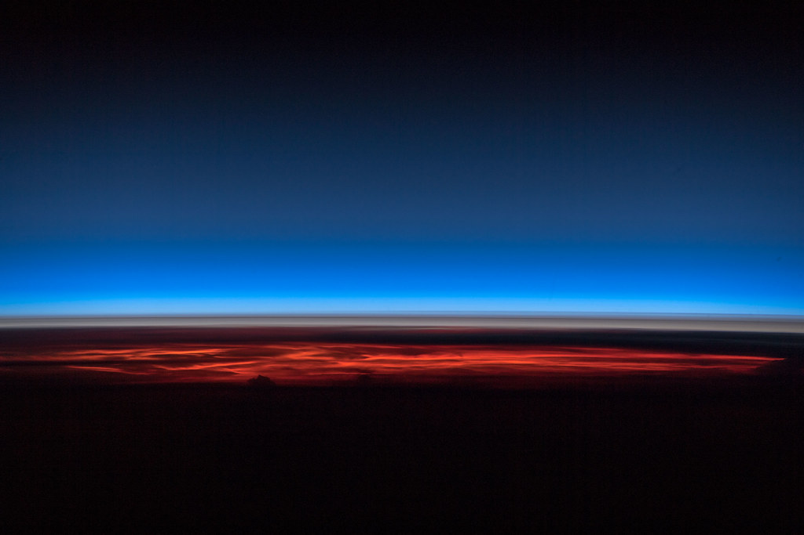

# Simulating the Atmosphere

## (for our project)

### (a very simplified overview)

---

## What can we expect (not) to see?

---

**Possible:**

- meridional overturning circulation (Hadley / Ferrel)
- some form of water evaporation / rainfall

**Not Possible:**

- zonal circulation (e.g., jet streams)
- eddies (Rossby waves)

---

## A Matter of Scales

---

## Modeling Assumptions

- "pizza model" $\leftrightarrow$ axi-symmetric model $\Rightarrow$ no day/night effects
- spherical coordinates
- neglect land/water surface height
- neglect effects of water content on dynamics and radiation
- treat solar radiation as ??
- ground can be land or water

---

## Model Equations

---

## Discretization Suggestions

Finite Differences in space & time

---

## Implementation Considerations I

---

## Implementation Considerations II

--- 

## Literature / References

---

### Image Credits

1: "Atmosphere | Atmosphäre" by Astro_Alex is licensed with CC BY-SA 2.0. [License Copy](https://creativecommons.org/licenses/by-sa/2.0/).

2: Screenshot from https://earth.nullschool.net/. (2021-09-17, 10:57)

3: Adapted from Fig. 2 in: Birner, Davis, Seidel: Physics Today  67, 38-44 (2014). DOI: [10.1063/PT.3.2620](https://doi.org/10.1063/PT.3.2620).
